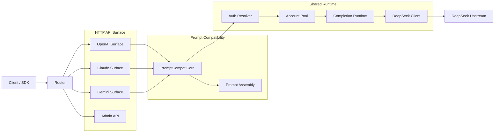

# NeutronAPI Architecture and Project Structure

This document maintains the canonical directory structure, module boundaries, and primary execution paths for the NeutronAPI project.

## 1. Top-level Directory Structure

| Directory | Purpose |
| --- | --- |
| `.github/` | CI/CD workflows and issue templates |
| `api/` | Serverless entry points (Vercel Go/Node) |
| `app/` | Application-level handler assembly |
| `cmd/` | Executable entry points (`neutronapi`, `neutronapi-tests`) |
| `docs/` | Project documentation |
| `internal/` | Core implementation (private) |
| `pow/` | DeepSeek Proof-of-Work (PoW) implementation |
| `scripts/` | Build, release, and helper scripts |
| `static/` | Build artifacts (WebUI static files) |
| `tests/` | Test resources, fixtures, and E2E scripts |
| `webui/` | React admin panel source code |

### Internal Submodules

- `internal/account/`: Account pool, concurrency slots, and wait queues.
- `internal/auth/`: Authentication, JWT, and credential parsing.
- `internal/chathistory/`: Server-side conversation persistence.
- `internal/completionruntime/`: Shared Go logic for starting, collecting, and retrying completions.
- `internal/deepseek/`: Upstream DeepSeek client, protocol, and transport details.
- `internal/format/`: Response formatters for OpenAI and Claude protocols.
- `internal/httpapi/`: Protocol-specific HTTP surfaces (OpenAI, Claude, Gemini, Admin).
- `internal/js/`: Node.js Runtime logic for Vercel streaming and tool call sieving.
- `internal/promptcompat/`: Core engine for converting API requests to DeepSeek web-chat context.
- `internal/sse/`: SSE parsing utilities.
- `internal/stream/`: Unified stream consumption engine.
- `internal/toolcall/`: Tool call parsing and DSML/XML normalization.

## 2. Primary Execution Flow

## 3. WebUI Integration

- The `webui/` folder contains the Vite + React source code.
- During deployment or the first local run, the WebUI is built into `static/admin`.
- The Go backend serves these static files under the `/admin` path.

## 4. Documentation Strategy

- **General Overview**: [README.MD](../README.MD)
- **Architecture**: `docs/ARCHITECTURE.md` (this file)
- **API Reference**: `API.md`
- **Deployment**: `docs/DEPLOY.md`
- **Testing**: `docs/TESTING.md`
- **Contributing**: `docs/CONTRIBUTING.md`
